# 📚 Formation Management Web Application

Une application web complète de gestion de formations, développée en PHP (MVC), avec une interface utilisateur en **Tailwind CSS** et une architecture conteneurisée avec **Docker**.

---


---

## 📌 Auteur

chaymae belamkadem

---

## Step 1: Create a Project Folder

- mkdir formation_management
- cd formation_management/
  
## Step 2: Create the docker-compose.yml file

Create a simple LAMP stack (Linux + Apache + MySQL + PHP) to run 
my web application using **Docker**.

Note : Docker/Composer versions
```
docker -v
composer -v
```
- Docker version 27.3.1, build ce12230
- Composer version 2.8.4 2024-12-11 11:57:47

## Step 3: Create public/index.php
This will help test if PHP is working.

```php
<?php
phpinfo()
```

## Step 4: Start Docker Environment

```
docker-compose up -d
```

### Then go to:

- http://localhost:8080 → PHP web app

- http://localhost:8081 → phpMyAdmin

### Login with:

- User: root
- Password: root

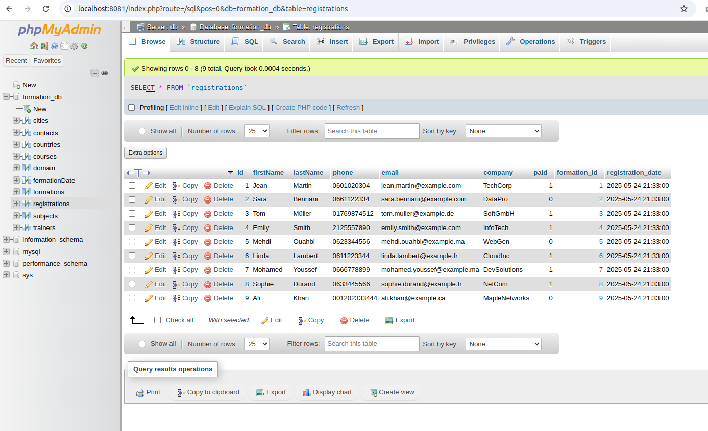

## 📂 Sommaire

- [Présentation](#présentation)
- [Frontend - Côté Client](#frontend---côté-client)
    - [Home Page](#home-page)
    - [Page Formations](#page-formations)
    - [Page Calendrier](#page-calendrier)
    - [Page Inscription](#page-inscription)
    - [Page Contact](#page-contact)
    - [Pages de Succès](#pages-de-succès)
- [Backend - Côté Admin](#backend---côté-admin)
    - [Dashboard](#dashboard)
    - [Gestion des Pays](#gestion-des-pays)
    - [Gestion des Villes](#gestion-des-villes)
    - [Gestion des Formateurs](#gestion-des-formateurs)
    - [Gestion des Domaines](#gestion-des-domaines)
    - [Gestion des Sujets](#gestion-des-sujets)
    - [Gestion des Cours](#gestion-des-cours)
    - [Gestion des Formations](#gestion-des-formations)
- [Technologies Utilisées](#technologies-utilisées)

---

## 🎯 Présentation

Cette application permet de :

- Présenter les formations d'une entreprise.
- Filtrer par thématique, spécialité, lieu, etc.
- S'inscrire à une formation.
- Gérer toutes les entités associées via un panneau admin (pays, villes, formateurs...).

---

## 🌐 Frontend - Côté Client

### 🏠 Home Page


Contient :
- Header et Footer
- Bannière d’accueil
- À propos de l’entreprise
- Nos formateurs
- Nos performances
- Nos domaines de formation

---

### 🎓 Page Formations

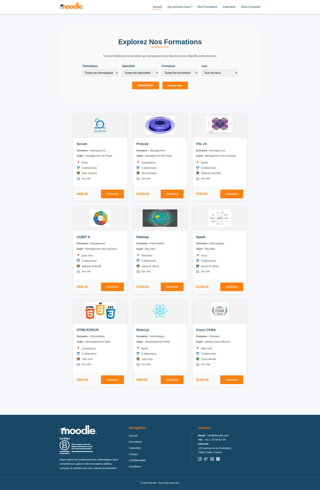

Contient :
- Filtres (Thématique, Spécialité, Formation, Lieu)
- Boutons de recherche et réinitialisation
- Liste de cartes formations
- Bouton pour s’inscrire

---

### 📅 Page Calendrier

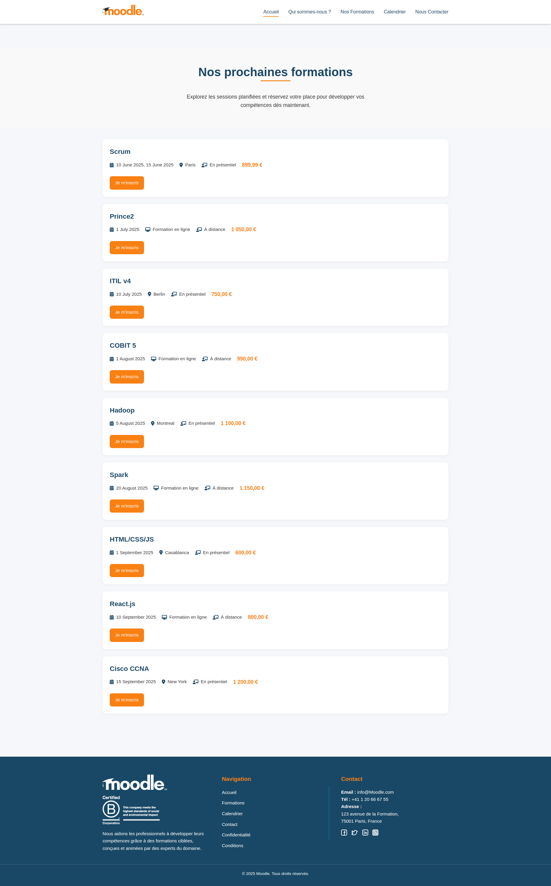

Contient :
- Liste des prochaines formations avec :
    - Nom du cours
    - Dates
    - Ville
    - Mode
    - Prix
    - Bouton d’inscription

---

### 📝 Page Inscription

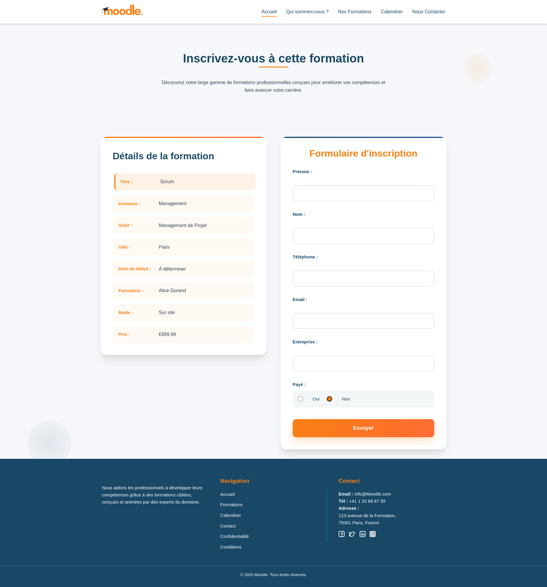

Contient :
- Détails de la formation
- Formulaire d’inscription

---

### 📬 Page Contact

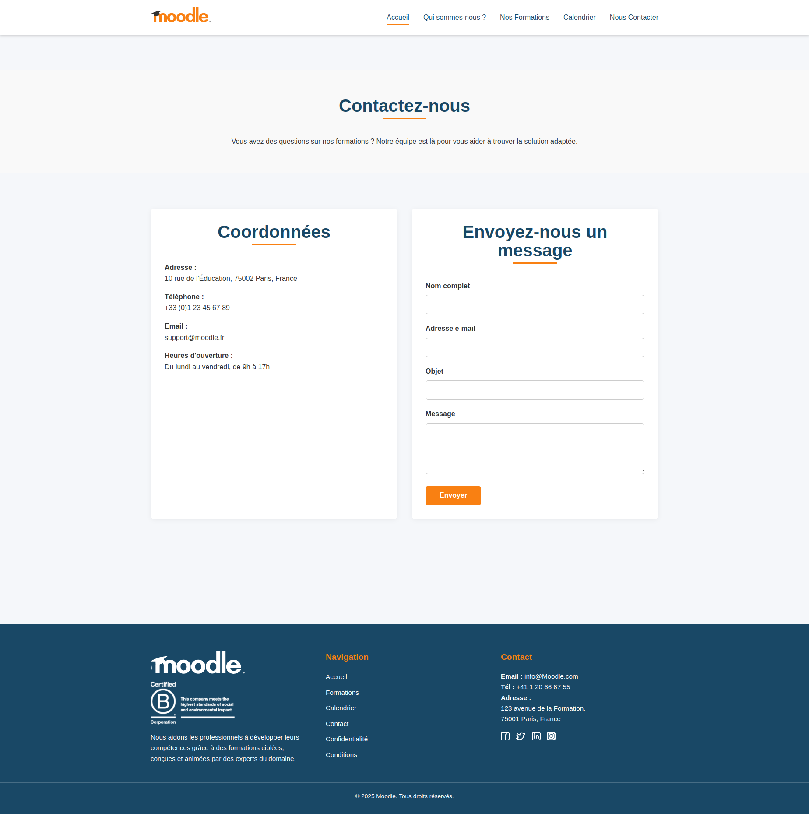

Contient :
- Formulaire pour envoyer un message

---

### ✅ Pages de Succès

- Confirmation d’inscription  
  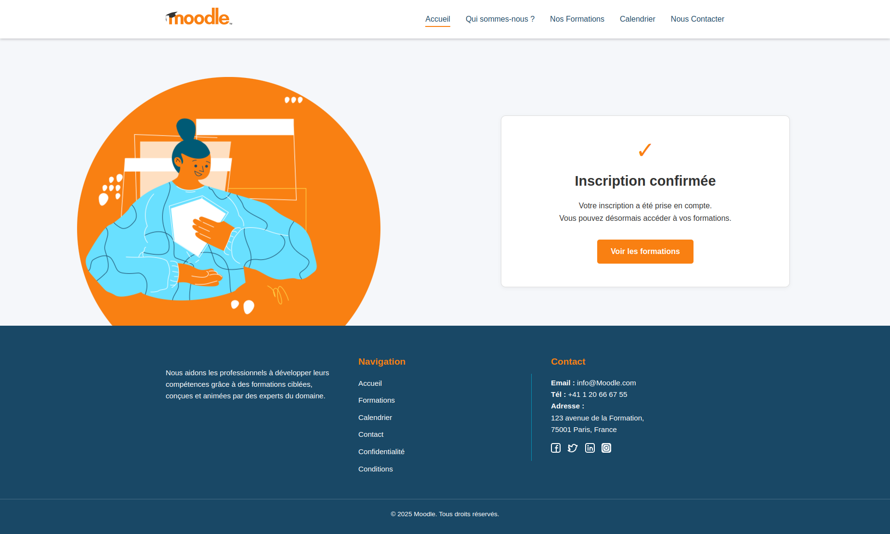

- Confirmation de message de contact  
  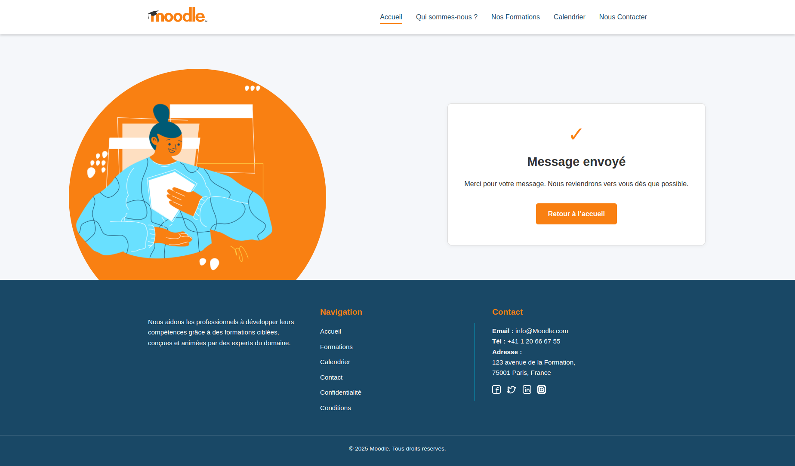

---

## 🔐 Backend - Côté Admin

### 📊 Dashboard

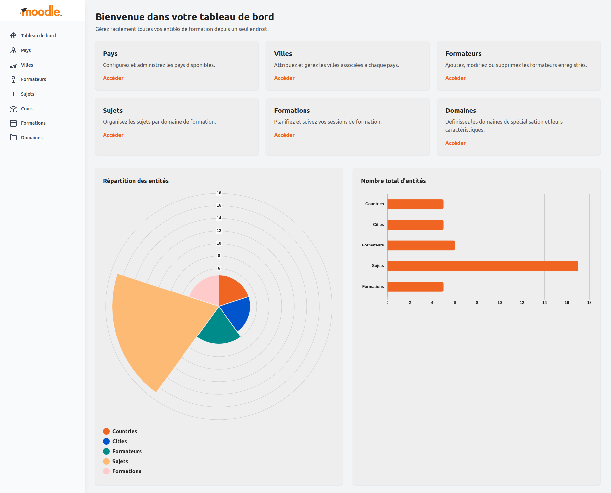

---

### 🌍 Gestion des Pays

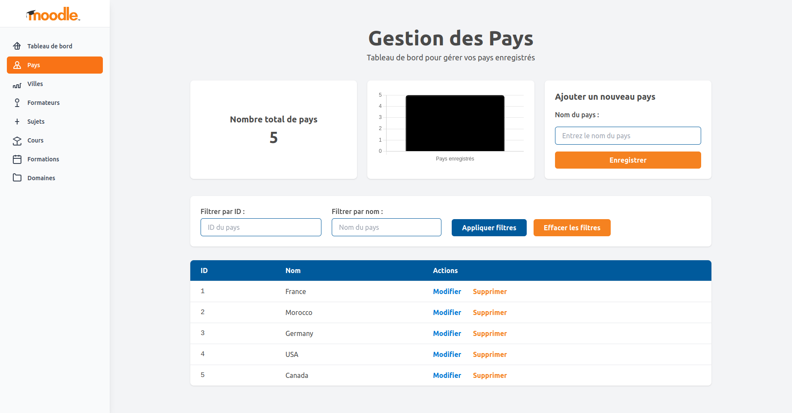

---

### 🏙️ Gestion des Villes

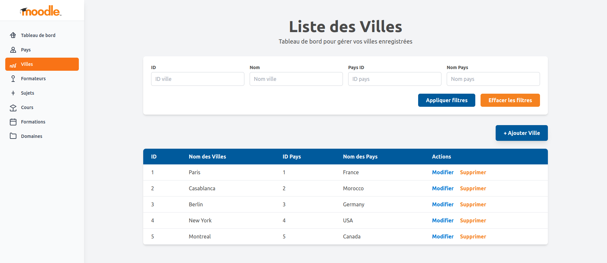

---

### 👩‍🏫 Gestion des Formateurs


---

### 📘 Gestion des Domaines


---

### 📚 Gestion des Sujets

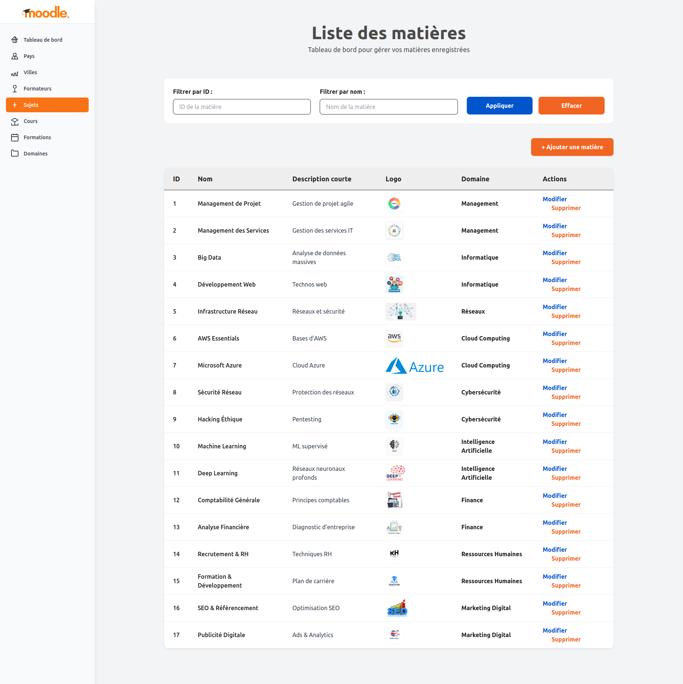

---

### 📒 Gestion des Cours

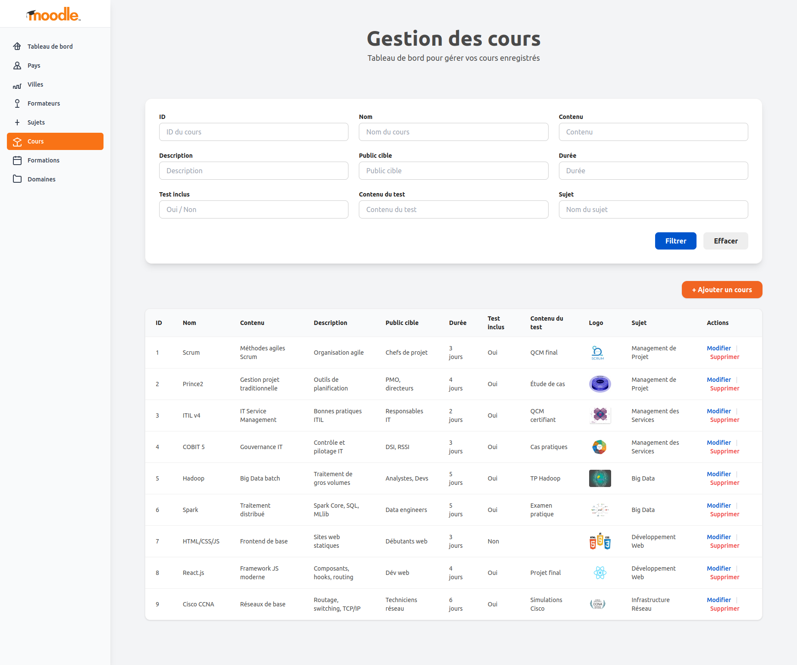
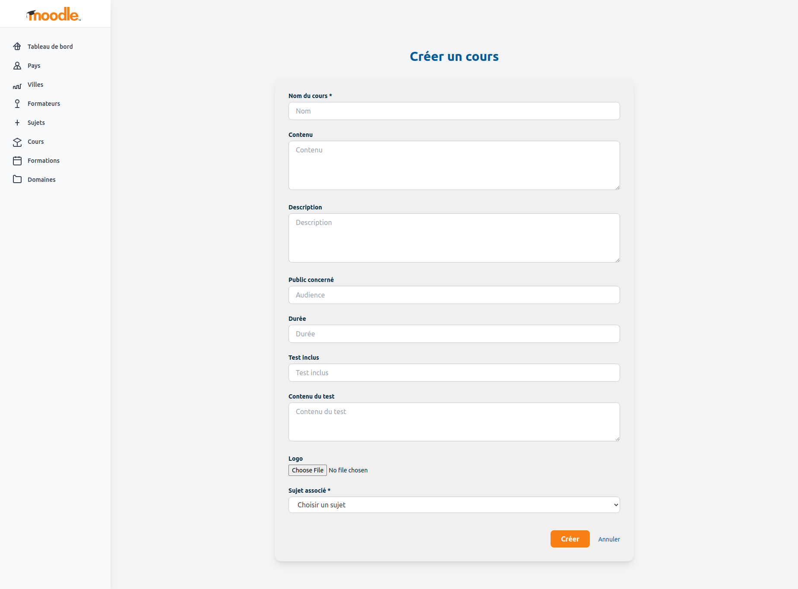

---

### 🗓️ Gestion des Formations

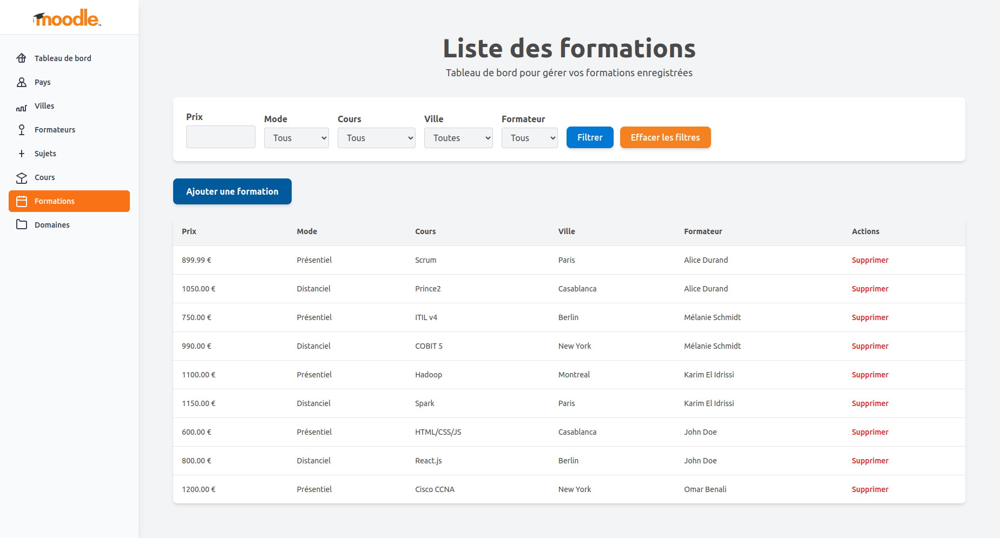

---

## ⚙️ Technologies Utilisées

- PHP avec architecture MVC
- HTML, CSS, Tailwind CSS
- JavaScript
- MySQL + phpMyAdmin
- Apache
- Docker
- Composer (autoloading)

---

### Warning: mkdir(): Permission denied : 

sudo chown -R www-data:www-data uploads              
sudo chmod -R 755 uploads

## Simple Data :

```
-- Insert countries
INSERT INTO countries (id, name) VALUES
(1, 'France'),
(2, 'Morocco'),
(3, 'Germany'),
(4, 'USA'),
(5, 'Canada');

-- Insert cities
INSERT INTO cities (id, name, country_id) VALUES
(1, 'Paris', 1),
(2, 'Casablanca', 2),
(3, 'Berlin', 3),
(4, 'New York', 4),
(5, 'Montreal', 5);

-- Insert domains
INSERT INTO domain (id, name, description) VALUES
(1, 'Management', 'Gestion et leadership'),
(2, 'Informatique', 'Technologies de l’information'),
(3, 'Réseaux', 'Administration et sécurité réseau')
(4, 'Cloud Computing', 'Infrastructure et services cloud'),
(5, 'Cybersécurité', 'Protection des systèmes et des données'),
(6, 'Intelligence Artificielle', 'Apprentissage automatique et IA'),
(7, 'Finance', 'Gestion financière et comptabilité'),
(8, 'Ressources Humaines', 'Gestion du personnel et développement RH'),
(9, 'Marketing Digital', 'Stratégies marketing en ligne');

-- Insert subjects
INSERT INTO subjects (id, name, shortDescription, longDescription, individualBenefit, businessBenefit, logo, domain_id) VALUES
(1, 'Management de Projet', 'Gestion de projet agile', 'Apprentissage des méthodes Scrum et Prince2', 'Compétence en gestion agile', 'Livraison rapide des projets', 'mgmt_project.png', 1),
(2, 'Management des Services', 'Gestion des services IT', 'ITIL, COBIT et autres frameworks', 'Maîtrise des processus IT', 'Optimisation des ressources IT', 'mgmt_services.png', 1),
(3, 'Big Data', 'Analyse de données massives', 'Spark, Hadoop et écosystème Big Data', 'Découverte de la data science', 'Valorisation de la donnée', 'big_data.png', 2),
(4, 'Développement Web', 'Technos web', 'HTML, CSS, JS, React, Node.js', 'Création d’applications modernes', 'Présence digitale renforcée', 'web.png', 2),
(5, 'Infrastructure Réseau', 'Réseaux et sécurité', 'Cisco, firewalls, VPN', 'Certifications reconnues', 'Sécurité améliorée', 'network.png', 3)
(6, 'AWS Essentials', 'Bases d’AWS', 'Introduction aux services AWS : EC2, S3, RDS...', 'Connaissance cloud', 'Maîtrise des services cloud', 'aws.png', 4),
(7, 'Microsoft Azure', 'Cloud Azure', 'Déploiement et gestion de ressources Azure', 'Compétence cloud Microsoft', 'Optimisation infrastructure IT', 'azure.png', 4),
(8, 'Sécurité Réseau', 'Protection des réseaux', 'Pare-feu, VPN, détection d’intrusion', 'Bases solides en cybersécurité', 'Sécurisation des données', 'security.png', 5),
(9, 'Hacking Éthique', 'Pentesting', 'Test d’intrusion et analyse de vulnérabilités', 'Savoir anticiper les attaques', 'Renforcement de la sécurité', 'hacking.png', 5),
(10, 'Machine Learning', 'ML supervisé', 'Régression, classification, modèles prédictifs', 'Maîtrise des modèles ML', 'Exploitation des données', 'ml.png', 6),
(11, 'Deep Learning', 'Réseaux neuronaux profonds', 'CNN, RNN, TensorFlow', 'Spécialisation IA', 'Valorisation avancée des données', 'deep.png', 6),
(12, 'Comptabilité Générale', 'Principes comptables', 'Bilans, journaux, comptes de résultat', 'Autonomie financière', 'Suivi précis des finances', 'accounting.png', 7),
(13, 'Analyse Financière', 'Diagnostic d’entreprise', 'Ratios, cashflow, rentabilité', 'Lecture des états financiers', 'Décision stratégique éclairée', 'finance.png', 7),
(14, 'Recrutement & RH', 'Techniques RH', 'Sourcing, entretiens, intégration', 'Compétences RH concrètes', 'Meilleur recrutement', 'rh.png', 8),
(15, 'Formation & Développement', 'Plan de carrière', 'GPEC, montée en compétence', 'Développement personnel', 'Fidélisation du personnel', 'gpec.png', 8),
(16, 'SEO & Référencement', 'Optimisation SEO', 'Mots-clés, contenu, backlinks', 'Visibilité web', 'Meilleur positionnement Google', 'seo.png', 9),
(17, 'Publicité Digitale', 'Ads & Analytics', 'Google Ads, réseaux sociaux, KPI', 'Maîtrise du webmarketing', 'Acquisition client optimisée', 'ads.png', 9);

-- Insert courses
INSERT INTO courses (id, name, content, description, audience, duration, testIncluded, testContent, logo, subject_id) VALUES
(1, 'Scrum', 'Méthodes agiles Scrum', 'Organisation agile', 'Chefs de projet', '3 jours', 'Oui', 'QCM final', 'scrum.png', 1),
(2, 'Prince2', 'Gestion projet traditionnelle', 'Outils de planification', 'PMO, directeurs', '4 jours', 'Oui', 'Étude de cas', 'prince2.png', 1),
(3, 'ITIL v4', 'IT Service Management', 'Bonnes pratiques ITIL', 'Responsables IT', '2 jours', 'Oui', 'QCM certifiant', 'itil.png', 2),
(4, 'COBIT 5', 'Gouvernance IT', 'Contrôle et pilotage IT', 'DSI, RSSI', '3 jours', 'Oui', 'Cas pratiques', 'cobit.png', 2),
(5, 'Hadoop', 'Big Data batch', 'Traitement de gros volumes', 'Analystes, Devs', '5 jours', 'Oui', 'TP Hadoop', 'hadoop.png', 3),
(6, 'Spark', 'Traitement distribué', 'Spark Core, SQL, MLlib', 'Data engineers', '5 jours', 'Oui', 'Examen pratique', 'spark.png', 3),
(7, 'HTML/CSS/JS', 'Frontend de base', 'Sites web statiques', 'Débutants web', '3 jours', 'Non', '', 'frontend.png', 4),
(8, 'React.js', 'Framework JS moderne', 'Composants, hooks, routing', 'Dév web', '4 jours', 'Oui', 'Projet final', 'react.png', 4),
(9, 'Cisco CCNA', 'Réseaux de base', 'Routage, switching, TCP/IP', 'Techniciens réseau', '6 jours', 'Oui', 'Simulations Cisco', 'cisco.png', 5);

-- Insert trainers
INSERT INTO trainers (id, firstName, lastName, description, photo) VALUES
(1, 'Alice', 'Durand', 'Experte Scrum et Prince2', 'alice.jpg'),
(2, 'Karim', 'El Idrissi', 'Formateur Big Data', 'karim.jpg'),
(3, 'Mélanie', 'Schmidt', 'Coach ITIL/COBIT', 'melanie.jpg'),
(4, 'John', 'Doe', 'Développeur React', 'john.jpg'),
(5, 'Omar', 'Benali', 'Expert réseau Cisco', 'omar.jpg');

-- Insert formations
INSERT INTO formations (id, price, mode, course_id, city_id, trainer_id) VALUES
(1, 899.99, 'présentiel', 1, 1, 1),
(2, 1050.00, 'distanciel', 2, 2, 1),
(3, 750.00, 'présentiel', 3, 3, 3),
(4, 990.00, 'distanciel', 4, 4, 3),
(5, 1100.00, 'présentiel', 5, 5, 2),
(6, 1150.00, 'distanciel', 6, 1, 2),
(7, 600.00, 'présentiel', 7, 2, 4),
(8, 800.00, 'distanciel', 8, 3, 4),
(9, 1200.00, 'présentiel', 9, 4, 5);

-- Insert formation dates
INSERT INTO formationDate (date, formation_id) VALUES
('2025-06-10', 1),
('2025-06-15', 1),
('2025-07-01', 2),
('2025-07-10', 3),
('2025-08-01', 4),
('2025-08-05', 5),
('2025-08-20', 6),
('2025-09-01', 7),
('2025-09-10', 8),
('2025-09-15', 9);

-- Insert registrations
INSERT INTO registrations (firstName, lastName, phone, email, company, paid, formation_id) VALUES
('Jean', 'Martin', '0601020304', 'jean.martin@example.com', 'TechCorp', TRUE, 1),
('Sara', 'Bennani', '0661122334', 'sara.bennani@example.com', 'DataPro', FALSE, 2),
('Tom', 'Müller', '01769874512', 'tom.muller@example.de', 'SoftGmbH', TRUE, 3),
('Emily', 'Smith', '2125557890', 'emily.smith@example.com', 'InfoTech', TRUE, 4),
('Mehdi', 'Ouahbi', '0623344556', 'mehdi.ouahbi@example.ma', 'WebGen', FALSE, 5),
('Linda', 'Lambert', '0611223344', 'linda.lambert@example.fr', 'CloudInc', TRUE, 6),
('Mohamed', 'Youssef', '0666778899', 'mohamed.youssef@example.ma', 'DevSolutions', TRUE, 7),
('Sophie', 'Durand', '0633445566', 'sophie.durand@example.fr', 'NetCom', TRUE, 8),
('Ali', 'Khan', '001202333444', 'ali.khan@example.ca', 'MapleNetworks', FALSE, 9);

-- Insert contacts
INSERT INTO contacts (name, email, phone, subject, message) VALUES
('Paul Lefèvre', 'paul.lefevre@example.com', '0611223344', 'Demande de formation', 'Bonjour, je souhaite plus d’infos sur la formation Scrum.'),
('Leila Zahraoui', 'leila.zahraoui@example.com', '0655667788', 'Inscription', 'Je veux m’inscrire à la formation Spark.'),
('Amine Lahcen', 'amine.lahcen@example.com', '0622334455', 'Tarif entreprise', 'Quels sont les tarifs pour un groupe ?'),
('Anna Fischer', 'anna.fischer@example.de', '01763441222', 'Formation COBIT', 'Avez-vous des sessions COBIT à distance ?');

```